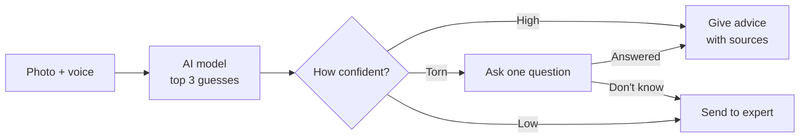

<div align="center">

# Bhoomi

**Catch crop disease and pest problems early — and never guess when unsure.**

Smart India Hackathon · **SIH26131** · Government of Maharashtra
*Early detection and management of crop diseases and pest infestations*

[](https://github.com/Spyro007-06/SIH26131-Bhoomi/actions/workflows/backend.yml)
[](LICENSE)
[](backend/pyproject.toml)
[](backend/pyproject.toml)
[](backend/docker-compose.yml)
[](app/README.md)
[](portal/README.md)

</div>

---

## What it does

A farmer takes a photo of a sick plant and speaks in Marathi or Hindi. Bhoomi does one of three things:

1. **Sure what it is** → gives step-by-step treatment advice from a trusted source
2. **Torn between two things** → shows both, asks one simple question ("is there grey fuzzy growth underneath?"), then decides
3. **Not sure at all** → says so and sends the case to a real agronomist

It also warns farmers *before* problems start, based on weather, and checks pesticide bottles to catch the wrong spray before it happens.

## Why this design

Most agri-chatbots try to answer everything. The real damage in farming isn't a missing answer — it's a **confident wrong answer**. Wrong diagnosis means wasted money, over-spraying, and lost yield.

So Bhoomi is built to say "I don't know" out loud. Four rules run through the whole codebase:

- **Never make things up.** No trusted source found = no advice given.
- **Uncertainty is shown, not hidden.** When the model is torn, the farmer sees it and helps decide.
- **Only veto pesticides, never approve them.** It can say "wrong crop, don't spray." It never says "this is safe."
- **Chemicals come last.** Advice always goes cultural → biological → chemical. The database refuses any other order.

## How a diagnosis is decided



| Confidence | What happens |
|---|---|
| 0.70 and above, clearly ahead | Gives treatment advice |
| 0.45 to 0.70, or two close guesses | Asks one clarifying question |
| Below 0.45, or unknown crop | Escalates to an agronomist |

These numbers live in one file (`backend/app/config.py`) and can't be changed from the environment, so nobody can quietly loosen them before a demo.

## What it covers

**4 crops:** paddy, cotton, soybean, jowar — **26 diseases and pests** in total.

Not everything can be diagnosed from a photo, so targets are split in two:

- **14 photo-diagnosable** — spots, lesions, mosaics, wilts. The camera can see them.
- **12 inspection-only** — a stem borer is *inside* the stem, a whitefly is 1 mm across, shoot fly damage looks like drought. These get risk alerts and "go look here" tasks instead of a guess.

Anything outside these 4 crops escalates rather than being answered.

## Main features

| Feature | What it does |
|---|---|
| **Farm memory** | Every farm keeps its full history — photos, diagnoses, treatments, outcomes |
| **Confidence gate** | One place decides: advise, ask, or escalate |
| **Doubt Doctor** | Asks one physical question to break a tie between two look-alikes |
| **Risk alerts** | Warns based on weather and crop stage, always with a "go check here" task |
| **Spread alerts** | A confirmed case warns nearby farms growing the same crop |
| **Grounded advice** | Every piece of advice cites a real source. Leads with what *not* to do |
| **Pesticide check** | Photograph the bottle; catches wrong crop, wrong pest, wrong chemical type |
| **Voice-first** | Marathi and Hindi speech in and out |
| **Follow-up** | Checks back after treatment: better, same, or worse |
| **Expert review** | Escalated cases arrive pre-packed so an agronomist can decide in 3 minutes |
| **Officials dashboard** | Outbreak map, counts by region, and how often the AI was right |

## Tech stack

| Part | Built with |
|---|---|
| Backend API | Python 3.11, FastAPI, SQLAlchemy |
| Database | PostgreSQL 16 + PostGIS (maps) + pgvector (search) |
| Farmer app | Flutter (Android) |
| Web portal | React + TypeScript + Vite |
| Vision | PyTorch image classifier |
| Voice | Sarvam (speech to text, text to speech, translation) |
| Weather | Open-Meteo |

## Project layout

```
backend/     Python API
  app/core/          database, alerts, follow-ups   (Shreekumar)
  app/vision/        image model, label OCR         (Suchit)
  app/intelligence/  gate, Doubt Doctor, advice     (Thaariha)
  app/voice/         speech in and out              (Shruthi)
  seed/              corpus and reference data
app/         Flutter farmer app                     (Tharun)
portal/      React web portal                       (Santheesh)
docs/        the specs — read these first
```

> Note: `app/` at the top level is the Flutter app. `backend/app/` is the Python code. Two different things with the same name.

## Running it

**Backend** (run from inside `backend/`):

```bash
cd backend
docker compose up -d                    # starts the database
python -m venv .venv && .venv/bin/pip install -e ".[dev]"
cp .env.example .env
alembic upgrade head                    # create tables
uvicorn app.main:app --reload           # http://localhost:8000/docs
```

Tests and linting:

```bash
pytest
ruff check app tests alembic
```

**Web portal:**

```bash
cd portal
npm install
npm run dev                             # http://localhost:5173
```

**Farmer app:**

```bash
cd app
flutter create . --project-name bhoomi
flutter run
```

### Running without the AI models

Set these in `.env` to run the full app before the models are wired up:

| Setting | Effect |
|---|---|
| `VISION_MODEL=stub` | Returns fake low-confidence guesses and marks them `is_stub`. The app **must** show a banner. |
| `ASR_PROVIDER=stub` | Skips real speech recognition |
| `LLM_ENABLED=false` | Skips advice generation |

The stub's confidence values are deliberately too low to ever produce advice, so a fake result can never be mistaken for a real one.

## Documentation

| File | What's in it |
|---|---|
| [`docs/PRD.md`](docs/PRD.md) | What we're building and why |
| [`docs/DESIGN.md`](docs/DESIGN.md) | How it's built |
| [`docs/API_CONTRACT.md`](docs/API_CONTRACT.md) | Every endpoint and response shape |
| [`CLAUDE.md`](CLAUDE.md) | Team rules and setup notes |

The three files in `docs/` are frozen. If a task and the docs disagree, the docs win.

## Team

| Name | Owns |
|---|---|
| Suchit | Image model and label OCR |
| Shreekumar | Backend, database, alerts, follow-ups |
| Thaariha | Confidence gate, Doubt Doctor, advice generation |
| Shruthi | Voice pipeline |
| Tharun | Flutter farmer app |
| Santheesh | Web portal and dashboard |

## License

[Apache 2.0](LICENSE)
