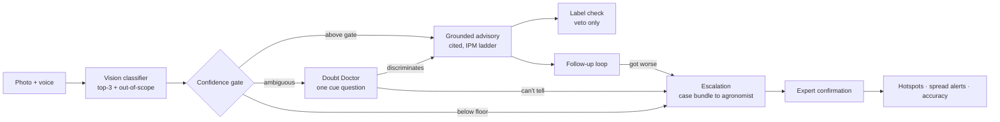
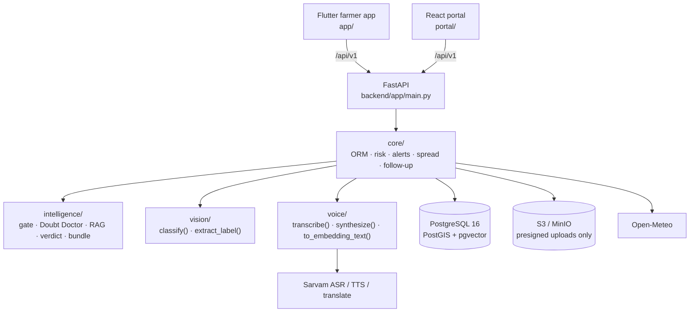

<div align="center">

# Bhoomi

**A voice-first crop health system that tells a farmer when and where to look, identifies what it finds or admits it cannot, asks one clarifying question instead of guessing, and vetoes the wrong pesticide before it is sprayed.**

Smart India Hackathon · **SIH26131** · Government of Maharashtra
*Early detection and management of crop diseases and pest infestations*

[](https://github.com/Spyro007-06/SIH26131-Bhoomi/actions/workflows/backend.yml)
[](LICENSE)
[](backend/pyproject.toml)
[](backend/pyproject.toml)
[](backend/docker-compose.yml)
[](app/README.md)
[](portal/README.md)

[Problem](#the-problem) · [Approach](#the-approach) · [Features](#feature-set) · [Architecture](#architecture) · [Getting started](#getting-started) · [API](#api-surface) · [Team](#team-and-ownership)

</div>

---

## The problem

Farmers notice disease and pest damage after it has spread. Extension staff cover too much ground, labs are slow, and the inputs that predict risk (weather, crop stage, variety, soil, local pest history) are never combined into anything actionable at farm level.

The harm named in the problem statement is not "no answer." It is **the confident wrong answer**: delayed treatment, over-spraying, residue violations, cost, yield loss. A system that guesses well most of the time and badly some of the time is worse for this problem than one that answers less often and says so.

Every design decision in this repository traces back to that single observation.

## The approach

Four guarantees, each enforced in code or in the database schema rather than in prompt wording.

| Guarantee | How it is enforced |
|---|---|
| **Never fabricate** | Retrieval below `RAG_THRESHOLD` produces no advice. An ingredient absent from the registered-use table returns `NOT_IN_RECORDS`, never an inferred verdict. |
| **Uncertainty is a feature surface** | The ambiguous confidence band routes to the Doubt Doctor, which shows both candidates and asks one discriminating physical question drawn from the corpus, never composed at runtime. |
| **Veto, never endorse** | The label check may say "this is wrong here." It may never say a product is safe. Verdict strings are fixed server-side and free of endorsement vocabulary. |
| **Chemical last, structurally** | The advisory ladder is ordered fields (cultural → biological → chemical) with a database CHECK on write. Leading with a pesticide is not expressible. |
| **Every alert carries a task** | `Alert.inspection_tasks` is non-empty at the schema level. "Risk is high" without "go look at the base of the stems" is noise. |

### The confidence gate

One function decides the outcome of every diagnosis. Exactly one outcome per call: never advice and escalation together, never neither. Thresholds are module constants in `backend/app/config.py`, deliberately not environment-tunable, so nobody can loosen the gate at demo time.

| Band | Condition | Outcome |
|---|---|---|
| Above gate | `top1 ≥ GATE` and `top1 − top2 ≥ MARGIN` | Compose grounded advisory |
| Ambiguous | `top1 ≥ FLOOR` and `top1 − top2 < MARGIN` | Doubt Doctor: one discriminating question |
| Below floor | `top1 < FLOOR`, target out of scope, or no relevant source | Escalate to an agronomist |

Starting values: `GATE = 0.70`, `FLOOR = 0.45`, `MARGIN = 0.15`, `RAG_THRESHOLD = 0.60`.



## Scope

**Four crops, 26 targets**, namespaced by crop (`cotton_bacterial_blight`, not `bacterial_blight`) so a wrong-crop match is unrepresentable rather than filtered out. Anything outside the set escalates.

Each target carries a tier, decided by one question: can a photograph of the plant settle what this is?

| Tier | Count | Behaviour | Examples |
|---|---|---|---|
| `diagnosable` | 14 | In the vision label set. Photo in, gated prediction out, advisory composed. | `paddy_blast`, `cotton_leaf_curl_virus`, `soybean_yellow_mosaic_virus`, `jowar_downy_mildew` |
| `inspection` | 12 | Never image-classified. Risk alerts with inspection tasks; advisory only after human confirmation. | `paddy_yellow_stem_borer` (larva inside the stem), `jowar_shoot_fly` (damage resembles drought), `cotton_whitefly` (1 mm, leaf underside) |

Moving a target from `diagnosable` to `inspection` later is always safe. The other direction is not.

**Explicitly out of scope:** pest-trap and sensor inputs, subsidy matching, land registry, irrigation planning, live government API integrations, true offline operation, and any claim of model fine-tuning or reinforcement learning.

## Feature set

| # | Feature | What it does |
|---|---|---|
| **T0** | **Spine** | |
| F1 | Farm persistent memory | Crop, variety, growth stage, region, geolocation, and the full history of problems, photos, diagnoses, treatments and confirmations. History is a risk input, not an archive. |
| F2 | Confidence gate | Three bands, one decision, a gate object returned to the client with confidence, threshold, reason code and ranked alternatives. |
| **T1** | **Detection** | |
| F3 | Image identification | Ranked top-3 with confidences plus an out-of-scope signal. Labels are pest species, not damage type. Handles damage-sign photos, not just clean insect shots. |
| F4 | Doubt Doctor | On the ambiguous band, shows both candidates and asks one physical question from structured `distinguishing_cues`. "Can't tell" escalates; the system never falls back to the higher-confidence label. |
| **T2** | **Forecasting and surveillance** | |
| F5 | Weather, season and soil risk | Forward-looking risk per target from weather, growth stage, soil, region and farm pest history. Every alert carries at least one inspection task naming where on the plant to look and when. |
| F6 | Nearby-farm spread alerts | A **confirmed** diagnosis warns same-crop farms within `SPREAD_RADIUS_M` via PostGIS. Unconfirmed model output never triggers village-wide alarm. |
| **T3** | **Management** | |
| F7 | Grounded advisory | Retrieval from a curated, dated, cited corpus. Fixed order: possible issue, what to check, **what to avoid**, action ladder, expert trigger. Chemical rungs carry dosage, PHI and re-entry. |
| F8 | Pesticide label check | OCR reads the bottle; ingredient + crop + target is looked up against a CIB&RC-sourced registered-use table. Verdicts veto, never endorse. Low OCR confidence asks for a clearer photo. |
| F9 | Voice-first multilingual | Marathi first, Hindi second, Tamil if hours allow. Translate-before-embed, so Devanagari is never stripped into a zero vector and a silently fabricated advisory. |
| F10 | Closed-loop follow-up | Improved / no change / got worse with an optional photo. Drives severity promotion and auto-escalation. |
| F11 | Farm health (thin) | One qualitative sentence and a trend arrow. No composite score, no weighted rubric. |
| **T4** | **Human loop** | |
| F12 | Expert validation | Case bundle routed to the next available agronomist with queue position and ETA. Target review time under three minutes. |
| F13 | Referral and helpline | One-tap routing to the local KVK, extension office or diagnostic lab. |
| F14 | Confirmation loop | Every confirmation or correction updates hotspot counts, nudges the count-based regional prior, and feeds field-accuracy numbers. Learns from field confirmations, which is not fine-tuning. |
| F15 | Officials dashboard | Hotspot map, outbreak counts by region and crop, confirmation queue, confirmed-versus-corrected accuracy. Read-only. |

## Architecture



Two structural rules hold this together:

- **`backend/app/core/` is the only package that touches the database.** `intelligence/` never queries directly; `core/` reads the rows and hands it typed objects.
- **`backend/app/contracts/` is frozen.** Three contracts (`vision.py`, `farm.py`, `gate.py`) plus every wire enum. Four workstreams and two clients build against these shapes.

### Repository layout

```
backend/            Python API (FastAPI, SQLAlchemy 2.0 async, Alembic)
  app/contracts/    the three frozen contracts + wire enums
  app/core/         models, routers, services — the only DB layer
  app/vision/       classifier, OCR label extraction
  app/intelligence/ gate, Doubt Doctor, RAG, verdict, case bundle
  app/voice/        ASR, TTS, translate-before-embed
  seed/corpus/      curated advisory corpus + distinguishing_cues.json
  seed/             registered_use.csv, inspection tasks, growth stages
app/                Flutter farmer app (Android)
portal/             React + Vite agronomist and officials portal
docs/               frozen specifications — read, do not edit
```

> **Name collision, read before you grep:** `app/` at the repository root is the Flutter app. `backend/app/` is the Python package. Both names come from the frozen design doc, so the prefix disambiguates. `from app.config import ...` in Python always means `backend/app/`.

## Getting started

### Backend

Every backend command runs from `backend/`, not the repository root.

```bash
cd backend
docker compose up -d                                  # Postgres 16 + PostGIS + pgvector, MinIO
python -m venv .venv && .venv/bin/pip install -e ".[dev]"   # Scripts\ on Windows
cp .env.example .env
alembic upgrade head
uvicorn app.main:app --reload                         # http://localhost:8000/docs
```

```bash
pytest                          # 200+ tests, no database required
ruff check app tests alembic
```

`docker compose up -d` leaves `bhoomi-minio-bucket` in state `exited (0)`. That is the bucket sidecar finishing successfully, not a crash.

### Portal

```bash
cd portal
npm install
cp .env.example .env.local      # VITE_API_BASE_URL=http://localhost:8000/api/v1
npm run dev                     # http://localhost:5173
```

### Farmer app

```bash
cd app
flutter create . --project-name bhoomi   # fills in around the existing feature folders
flutter run
```

### Feature flags

Three flags let the stack run before every model is wired. They live in `.env`; the gate thresholds deliberately do not.

| Flag | Values | Effect |
|---|---|---|
| `VISION_MODEL` | `stub` \| `live` | `stub` returns a fixed 0.34 / 0.33 / 0.33 distribution that never reads the image, sets `is_stub: true`, and logs a warning on every call. Those values sit below `FLOOR` and inside `MARGIN`, so the stub is structurally incapable of producing an advisory. |
| `ASR_PROVIDER` | `stub` \| `live` | `live` requires `SARVAMAI_API_KEY`. Model versions are pinned in `config.py`, not in the environment. |
| `LLM_ENABLED` | `false` \| `true` | Gates advisory composition. |

**Clients must render a stub banner whenever `is_stub` is true.** A stub that returns confident output on arbitrary input is worse than no feature.

## API surface

Base URL `/api/v1`. Bearer JWT with a `farmer`, `agronomist` or `official` role claim. UUID string ids, ISO 8601 UTC timestamps, one error envelope. Photos and audio never pass through the API: presign, PUT to storage, then reference the `asset_id`.

| Method | Path | Purpose |
|---|---|---|
| POST | `/auth/otp/request` · `/auth/otp/verify` · `/auth/login` | Farmer OTP, staff login |
| POST | `/assets/presign` | Presigned upload for photo and audio |
| POST | `/voice/transcribe` · `/voice/synthesize` | ASR / TTS |
| POST GET PATCH | `/farms` · `/farms/{id}` · `/farms/{id}/summary` | Farm profile and case file |
| POST | `/farms/{id}/diagnose` | Gated diagnosis |
| POST | `/problems/{id}/clarify` | Doubt Doctor answer |
| POST | `/advisory/query` | Standalone grounded query |
| POST | `/problems/{id}/label-check` | Pesticide veto |
| GET POST | `/farms/{id}/alerts` · `/alerts/{id}/respond` | Early warning and inspection outcomes |
| GET | `/farms/{id}/timeline` · `/problems` · `/problems/{id}` | Case history |
| GET POST | `/farms/{id}/followups/pending` · `/followups/{id}/respond` | Follow-up loop |
| POST GET | `/problems/{id}/escalate` · `/cases/{id}` | Escalation and case bundle |
| GET POST | `/agronomist/case-queue` · `/cases/{id}/confirm` | Expert queue and confirmation |
| GET | `/farms/{id}/referrals` | Referral and helpline |
| GET | `/officials/hotspots` · `/officials/accuracy` · `/officials/queue` | Surveillance dashboard |

Full request and response shapes: [`docs/API_CONTRACT.md`](docs/API_CONTRACT.md).

## Invariants

Fourteen properties must hold on every response. Each is testable and each protects a stated guarantee. A representative selection:

1. Every diagnose response carries a `gate` object, and exactly one of `advisory`, `clarification` or `escalation`.
2. `gate.alternatives` is populated on all three branches; no `advisory` field appears on a clarify or escalate outcome.
3. `advisory.ladder` is chemical-last, and a chemical rung carries dosage, PHI and re-entry or is omitted.
4. `alerts[].inspection_tasks` is never empty.
5. Label-check verdicts are fixed server-supplied strings, free of endorsement vocabulary. An unknown ingredient returns `NOT_IN_RECORDS`.
6. Only confirmed diagnoses drive spread alerts and hotspot points.
7. Only `diagnosable` targets reach the gate.
8. A `TopK` sums to at most 1.0, not exactly: it is the top three of a softmax over 26 classes.

Where possible these are enforced by the database rather than by Python. `Alert.inspection_tasks` non-empty and `Advisory.ladder` chemical-last are Postgres CHECK constraints, because a rule enforced only in application code is a rule somebody bypasses at hour 25.

## Testing and CI

```bash
cd backend && pytest -q && ruff check app tests alembic
```

GitHub Actions runs Ruff and the full Python suite on every push and pull request touching `backend/**`. The suite is deliberately database-free at this phase.

Two structural tests are worth knowing about:

- `tests/test_config.py::test_thresholds_are_declared_only_in_config` walks the AST of every module under `backend/app/` and fails if a threshold is bound outside `config.py`.
- `tests/test_structure.py` enforces that unimplemented modules stay as a docstring and nothing else, so an owner never has to delete somebody's placeholder before starting.

**Verification standard:** a feature is verified when a live HTTP response is pasted showing the expected output. Import success, build success and "I ran it" are not verification. Before trusting a curl result, confirm which process is answering on the port and when it started.

## Documentation

| Document | Contents |
|---|---|
| [`docs/PRD.md`](docs/PRD.md) | What and why: principles, scope, F1–F15, end-to-end scenario, risks |
| [`docs/DESIGN.md`](docs/DESIGN.md) | How: module boundaries, contracts, constants, verification standard |
| [`docs/API_CONTRACT.md`](docs/API_CONTRACT.md) | Wire format: enums, endpoints, error envelope, invariants |
| [`CLAUDE.md`](CLAUDE.md) | Working agreement: ownership, non-negotiable rules, local setup |
| [`backend/seed/README.md`](backend/seed/README.md) | Corpus and registered-use table sourcing |

The three documents in `docs/` are frozen. Where a task and those documents disagree, the documents win.

## Demo path

The end-to-end run in `docs/PRD.md` §6 touches every clause of the problem statement: a risk alert with an inspection task, a photo the model is genuinely torn on, the Doubt Doctor resolving it with one question, an advisory that leads with what to avoid, a pesticide vetoed for the wrong crop, a follow-up that escalates, an expert confirmation inside three minutes, and hotspots lighting up for neighbouring farms.

Three questions a judge will ask, and where the answer lives:

- *What happens when it's wrong?* The ambiguous band, live, then an out-of-scope photo that escalates instead of answering.
- *How does this reduce pesticide use?* The ladder is ordered fields, so a chemical cannot be first, and the label check vetoes a real bottle.
- *Does it actually learn?* Confirm a case in the portal and watch the dashboard counts and hotspot map move.

## Team and ownership

Six people, one module each, reviews routed by [`CODEOWNERS`](CODEOWNERS).

| Owner | Module | Scope |
|---|---|---|
| **Suchit** | `backend/app/vision/` | Classifier and OCR label extraction |
| **Shreekumar** | `backend/app/core/`, app foundation | Schema, CRUD, risk engine, alerts, spread, follow-up, confirmation |
| **Thaariha** | `backend/app/intelligence/` | Gate, Doubt Doctor, RAG, verdict, case bundle |
| **Shruthi** | `backend/app/voice/` | ASR, TTS, translate-before-embed |
| **Tharun** | `app/` | Flutter farmer app |
| **Santheesh** | `portal/` | Agronomist workspace (F12), officials dashboard (F15) |

Modules talk through typed functions, not by reaching into each other's tables. If you need something from another module, ask for a function, not a table.

## License

[Apache License 2.0](LICENSE).
