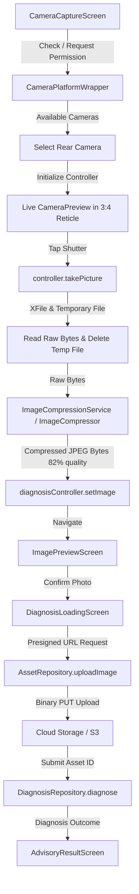

# Bhoomi Farmer App — Real Camera & Image Compression Pipeline (P2)

## 1. Overview

The mock leaf image generator (`_generateSampleLeafBytes()` and dummy JPEG headers) has been completely removed from production code and replaced with a real device camera capture and image compression pipeline.

The pipeline integrates:
* `camera: ^0.10.5+9` for hardware camera discovery, rear-lens selection, live `CameraPreview`, flash control, and real photo capture via `controller.takePicture()`.
* `flutter_image_compress: ^2.1.0` for in-memory / file-based photo compression (JPEG, 82% quality, 1080x1080 bounding envelope).
* `permission_handler: ^11.3.1` for runtime camera permission negotiation and permanently-denied settings navigation.
* `path_provider` and `dart:io` for secure local disk temporary file handling and immediate cleanup after byte extraction.
* Riverpod state management and `AssetRepository` 2-step presigned S3 upload (`POST /assets/presign` -> binary PUT -> `DiagnosisRepository.diagnose()`).

---

## 2. Architecture & Components

### Core Abstractions

1. **`CameraPlatformWrapper` & `DefaultCameraPlatformWrapper`** ([`camera_service.dart`](file:///d:/Project/SIH26131-Bhoomi/app/lib/core/utils/camera_service.dart)):
   - Defines injectable contracts for `requestCameraPermission()`, `isCameraPermissionGranted()`, `isCameraPermissionPermanentlyDenied()`, `getAvailableCameras()`, `openAppSettings()`, and `createController()`.
   - Protects tests from hanging on native method channels while delegating cleanly in production.

2. **`ImageCompressor` & `DefaultImageCompressor`** ([`image_compression_service.dart`](file:///d:/Project/SIH26131-Bhoomi/app/lib/core/utils/image_compression_service.dart)):
   - Defines injectable compression contract.
   - Default implementation leverages `FlutterImageCompress.compressWithList()` with `CompressFormat.jpeg`, quality `82`, `minWidth: 1080`, and `minHeight: 1080`.
   - Includes validation guards (rejects empty byte streams immediately without invoking native codecs).

3. **`CameraCaptureScreen`** ([`camera_capture_screen.dart`](file:///d:/Project/SIH26131-Bhoomi/app/lib/features/diagnose/presentation/camera_capture_screen.dart)):
   - **Preview Aspect Ratio**: 3:4 crop reticle matching standard agricultural pest vision models.
   - **Lens Selection**: Auto-discovers hardware cameras, preferring `CameraLensDirection.back`.
   - **Lifecycle Management**: Implements `WidgetsBindingObserver` to safely pause/dispose the camera texture on `AppLifecycleState.inactive` / `paused`, and re-initialize upon `resumed`.
   - **Flash Modes**: Toggles across Auto, Always (On), and Off with accessible semantic tooltips.
   - **Temporary File Hygiene**: Deletes temporary disk files immediately after in-memory byte extraction.

---

## 3. Localization & Error States

All user-facing states are localized across Marathi (mr), Hindi (hi), and English (en):

| State / Action | Marathi (mr) | Hindi (hi) | English (en) |
|---|---|---|---|
| Reticle Framing Guide | पाने किंवा बाधित भाग चौकटीत ठेवा | पत्ते या प्रभावित भाग फ्रेम में रखें | Place leaves or affected area in frame |
| Initializing | कॅमेरा सुरू होत आहे... | कैमरा शुरू हो रहा है... | Starting camera... |
| Permission Required | पिकाचे फोटो घेण्यासाठी कॅमेरा परवानगी आवश्यक आहे. | फसल की तस्वीर लेने के लिए कैमरा अनुमति आवश्यक है। | Camera permission is required to take crop photos. |
| Permission Denied Forever | कृपया सेटिंग्जमध्ये जाऊन कॅमेरा परवानगी द्या. | कृपया सेटिंग्स में जाकर कैमरा अनुमति दें। | Please grant camera permission in App Settings. |
| Camera Unavailable | या डिव्हाइसवर कॅमेरा उपलब्ध नाही. | इस डिवाइस पर कैमरा उपलब्ध नहीं है। | Camera is unavailable on this device. |
| Shutter Button | कॅमेराने पिकाचा फोटो काढा | कैमरे से फसल की तस्वीर लें | Capture crop photo with camera |
| Flash Toggle | कॅमेरा फ्लॅश चालू किंवा बंद करा | कैमरा फ़्लैश चालू या बंद करें | Toggle camera flash |

---

## 4. Verification & Testing

### Automated Test Coverage

1. **Unit Tests** ([`camera_preview_flow_test.dart`](file:///d:/Project/SIH26131-Bhoomi/app/test/camera_preview_flow_test.dart)):
   - `ImageCompressionService` compression with raw byte arrays.
   - `ImageCompressionService` empty byte handling.

2. **Widget & End-to-End Flow Tests** ([`camera_preview_flow_test.dart`](file:///d:/Project/SIH26131-Bhoomi/app/test/camera_preview_flow_test.dart)):
   - Complete capture flow: Camera Preview -> Shutter Tap -> Hardware Capture -> Compression -> Navigation to `ImagePreviewScreen` -> Confirmation -> 2-step Presigned Upload -> `AdvisoryResultScreen`.
   - Permission Denied state with "Grant Permission" retry action.
   - Permanently Denied state with "Open Settings" action.
   - No Camera hardware available error handling.

3. **Master Regression Suites**:
   - `flutter analyze`: **0 issues found** (100% clean).
   - `flutter test`: **159 / 159 tests passing** across all units, widgets, and full user journeys.
